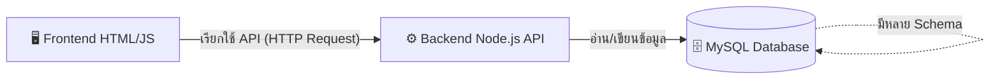

# 📘 คู่มือแนะนำและติดตั้งระบบ IPQC Web Application (สำหรับผู้เริ่มต้น)

คู่มือฉบับนี้จัดทำขึ้นเพื่อให้ผู้ที่มารับช่วงต่อ หรือผู้ที่สนใจ สามารถเข้าใจโครงสร้างการทำงานของระบบ **IPQC Web Application (Dispensing, Laser, POF, Damper)** ได้อย่างรวดเร็ว และสามารถตั้งค่า (Setup) ระบบเพื่อรันบนเครื่อง Server หรือเครื่องส่วนตัวได้อย่างถูกต้องและเป็นระเบียบ

---

## 🏗️ 1. สถาปัตยกรรมของระบบ (System Architecture)

ระบบนี้ถูกออกแบบมาในรูปแบบ **Web Application (Client-Server Architecture)** โดยแบ่งการทำงานออกเป็น 3 ส่วนหลัก (3-Tier) ดังนี้:

### 🖥️ 1.1 Frontend (ส่วนหน้าบ้าน)
- **เครื่องมือที่ใช้:** HTML5, CSS3 (Vanilla), JavaScript (ES6)
- **หน้าที่:** เป็นหน้าจอส่วนติดต่อผู้ใช้ (UI) สำหรับให้พนักงาน QC กรอกข้อมูล, คำนวณสถิติเบื้องต้นแบบ Real-time, แจ้งเตือนสีแดง/เขียว (Pass/Fail) และมีระบบ Save Draft ลงใน `localStorage` ของเบราว์เซอร์

### ⚙️ 1.2 Backend (ส่วนหลังบ้าน / Node.js API)
- **เครื่องมือที่ใช้:** **Node.js** (รันบน Express.js Framework)
- **หน้าที่:** เป็น API Server (Application Programming Interface) ทำหน้าที่เป็นตัวกลางรับข้อมูลจาก Frontend มาตรวจสอบ แล้วทำการเชื่อมต่อไปยัง Database แบบ Asynchronous เพื่อความรวดเร็ว

### 🗄️ 1.3 Database & Web Server (ฐานข้อมูลและเซิร์ฟเวอร์)
- **เครื่องมือที่ใช้:** **XAMPP** (รวม Apache Web Server, MySQL และ phpMyAdmin)
- **หน้าที่:** 
  - **MySQL:** เก็บข้อมูล Record และการตั้งค่า Spec
  - **phpMyAdmin:** ระบบจัดการฐานข้อมูลผ่านหน้าเว็บ (GUI)
  - **Apache:** ทำหน้าที่เป็น Web Server สำหรับเปิดหน้าเว็บในวง LAN



---

## 🛠️ 2. การเตรียมความพร้อมก่อนติดตั้ง (Prerequisites)

ก่อนที่จะรันระบบได้ เครื่อง Server จำเป็นต้องติดตั้งโปรแกรมดังต่อไปนี้:

1. **XAMPP:** ใช้สำหรับรันเซิร์ฟเวอร์จำลอง (Apache) และฐานข้อมูล (MySQL)
   - 📥 ดาวน์โหลด: [https://www.apachefriends.org/](https://www.apachefriends.org/)
2. **Node.js:** ใช้สำหรับรันระบบ Backend API เพื่อรับส่งข้อมูลกับ Database
   - 📥 ดาวน์โหลด: [https://nodejs.org/](https://nodejs.org/) (แนะนำเวอร์ชัน LTS)

---

## 🚀 3. ขั้นตอนการติดตั้งและรันระบบ (Step-by-Step Guide)

### 🔹 ขั้นตอนที่ 1: ตั้งค่าและเปิดใช้งาน XAMPP
1. ติดตั้ง XAMPP ให้เรียบร้อย และเปิดโปรแกรม **XAMPP Control Panel**
2. กดปุ่ม **Start** ที่บรรทัด **Apache** (Web Server)
3. กดปุ่ม **Start** ที่บรรทัด **MySQL** (Database)
4. เมื่อตัวหนังสือเป็นแถบสีเขียว ถือว่าเซิร์ฟเวอร์พร้อมใช้งาน

### 🔹 ขั้นตอนที่ 2: สร้างฐานข้อมูลด้วย phpMyAdmin (เพิ่ม Schema ที่สอง)
เพื่อให้ข้อมูลเป็นระเบียบ เราจะทำการสร้าง Database Schema หลัก 1 ตัว และสร้างแยกอีก 1 ตัว (ตาม Requirements)

1. เปิดเบราว์เซอร์ พิมพ์ URL: `http://localhost/phpmyadmin`
2. **สร้าง Schema ที่ 1 (ฐานข้อมูลหลัก):**
   - คลิกเมนู **"New"** ทางแถบซ้ายมือ 
   - ตั้งชื่อ Database ว่า `belton_ipqc` (เลือก Collation: `utf8mb4_general_ci`) แล้วกด **Create**
   - นำไฟล์ SQL หลักมา **Import** เข้าสู่ Schema นี้
3. **สร้าง Schema ที่ 2 (ฐานข้อมูลรอง/สร้างเพิ่ม):**
   - คลิกเมนู **"New"** อีกครั้ง
   - ตั้งชื่อ Database ตัวที่สอง เช่น `belton_ipqc_logs` หรือ `belton_ipqc_analytics` (เลือก Collation: `utf8mb4_general_ci`) แล้วกด **Create**
   - นำไฟล์ SQL ของ Schema ที่สองมา Import หรือสร้าง Table ใหม่เพื่อแยกเก็บข้อมูล

### 🔹 ขั้นตอนที่ 3: ตั้งค่า Node.js สำหรับเชื่อมต่อ API และ Database
เราจะใช้ Node.js ทำหน้าที่เป็น API สื่อสารกับทั้ง 2 Schemas:

1. เข้าไปที่โฟลเดอร์ของ **Backend API** (โฟลเดอร์ที่มีไฟล์ `server.js` และ `package.json`)
2. เปิด Terminal ในโฟลเดอร์นี้ แล้วติดตั้งไลบรารี (หากยังไม่เคยติดตั้ง):
   ```bash
   npm install
   ```
3. เปิดไฟล์ตั้งค่า (เช่น `config.js` หรือ `.env`) และเพิ่มการเชื่อมต่อฐานข้อมูลสำหรับทั้ง 2 Schemas ตัวอย่างโค้ด (ใช้ `mysql2`):
   ```javascript
   // การเชื่อมต่อ Schema ที่ 1 (ข้อมูลหลัก)
   const dbMain = mysql.createPool({
       host: 'localhost',
       user: 'root',
       password: '',
       database: 'belton_ipqc'
   });

   // การเชื่อมต่อ Schema ที่ 2 (ข้อมูลเพิ่มเติมที่สร้างแยก)
   const dbSecondary = mysql.createPool({
       host: 'localhost',
       user: 'root',
       password: '',
       database: 'belton_ipqc_logs' // เปลี่ยนชื่อให้ตรงกับ Schema ที่สร้างเพิ่ม
   });
   ```
4. รันระบบ Backend API:
   ```bash
   node server.js
   ```
   *(หากคอนโซลขึ้นว่า Connected to Database แสดงว่า API พร้อมเชื่อมต่อแล้ว)*

### 🔹 ขั้นตอนที่ 4: นำโค้ด Frontend ไปวางบน Server
1. นำไฟล์โค้ดส่วนหน้าบ้านทั้งหมด ไปวางไว้ใน `htdocs` ของ XAMPP (เช่น `C:\xampp\htdocs\ipqc_system`)
2. เปิดเบราว์เซอร์ ทดสอบรันหน้าเว็บที่: `http://localhost/ipqc_system/` 
3. หน้าเว็บ (Frontend) จะทำการยิงข้อมูลผ่าน HTTP Request ไปหา Node.js API และ Node.js จะนำไปจัดการลง Database (Schema ที่เลือก) ต่อไป

---

## 🎯 4. วิธีการดูแลรักษาระบบ (Maintenance & Troubleshooting)

> [!WARNING]
> **ปัญหาที่พบบ่อยและวิธีการแก้ไขเบื้องต้น**

1. ❌ **"เชื่อมต่อ API ไม่ได้" (Offline Mode)**
   - **สาเหตุ:** Backend (Node.js) ดับ
   - **วิธีแก้:** เปิด Terminal รันคำสั่ง `node server.js` ใหม่ *(บนโปรดักชันควรใช้ PM2 รัน Background)*

2. ❌ **เข้าหน้าเว็บ Localhost ไม่ได้**
   - **สาเหตุ:** Apache ใน XAMPP ปิดอยู่
   - **วิธีแก้:** เปิด XAMPP กด Start Apache

3. ❌ **ข้อมูลโหลดไม่ขึ้น หรือเชื่อมต่อฐานข้อมูลไม่ได้**
   - **สาเหตุ:** MySQL ปิดอยู่ หรือชื่อ Schema ในโค้ด Node.js ไม่ตรงกับ phpMyAdmin
   - **วิธีแก้:** ตรวจสอบ XAMPP (Start MySQL) และเช็คไฟล์ config ของ Node.js ว่าสะกดชื่อ Database ถูกต้องหรือไม่

4. ❌ **Port ชนกัน (Start ไม่ขึ้น)**
   - **สาเหตุ:** Port 80 (Apache) หรือ 3000 (Node.js) ถูกโปรแกรมอื่นใช้งาน
   - **วิธีแก้:** เปลี่ยน Port ใน Config (เช่น แก้ Apache เป็น 8080 หรือแก้ `.env` ของ Node.js)

---

## 📂 สรุปการเชื่อมต่อระบบให้เป็นระเบียบ

- **แยกการประมวลผลชัดเจน:** เราให้ **Node.js** จัดการเรื่อง API และ Business Logic โดยเฉพาะ ลดภาระของหน้าเว็บ 
- **จัดการข้อมูลมีโครงสร้าง:** การเพิ่ม **Schema ที่สอง** ใน phpMyAdmin ช่วยแยกประเภทข้อมูล (เช่น ข้อมูลหลัก vs ข้อมูล Log/ตั้งค่า) ทำให้การทำ Query สบายและฐานข้อมูลไม่บวม
- **ยืดหยุ่นด้วย API:** Frontend สามารถขอข้อมูลจาก Schema ใดก็ได้ผ่าน Node.js โดยไม่ต้องรับรู้ถึงโครงสร้าง Database โดยตรง ช่วยเพิ่มความปลอดภัยของระบบ
